# 📱 iOS Project Skeleton - YAML-Driven Architecture


A professional iOS project skeleton that demonstrates how to structure and organize a SwiftUI application using MVVM architecture. This template provides an automated workflow for generating project structure from YAML configuration files, using Tuist for project management and yq for YAML processing. Perfect for kickstarting new iOS projects with a clean, scalable architecture.

---

## 📋 Table of Contents

- [Why Use This Skeleton?](#-why-use-this-skeleton)
- [Features](#-features)
- [Architecture Overview](#-architecture-overview)
- [Requirements](#-requirements)
- [Quick Start](#-quick-start)
- [Installation Guide](#-installation-guide)
- [YAML Configuration](#-yaml-configuration)
- [Project Structure](#-project-structure)
- [How It Works](#-how-it-works)
- [Template Types Reference](#-template-types-reference)
- [Customization](#-customization)
- [Contributing](#-contributing)
- [License](#-license)
- [Authors](#-authors)

---

## 🎯 Why Use This Skeleton?

### The Problem

Starting a new iOS project often involves:
- ⏰ Hours of manual folder creation
- 📁 Inconsistent project structures across teams
- 🔄 Repetitive boilerplate code writing
- 📝 Difficulty documenting architecture decisions
- 🚫 No version control for project structure

### The Solution

This skeleton provides:
- ⚡ **Instant Setup** - Generate complete project structure in seconds
- 📐 **YAML-Driven** - Define architecture in a single, readable file
- 🔄 **Reproducible** - Same structure across all environments
- 📚 **Well-Documented** - Architecture as code
- 🎨 **Template System** - Pre-built file templates for common patterns
- 🛠️ **Tuist Integration** - Professional project management

---

## ✨ Features

- ✅ **YAML-Driven Architecture** - Define your entire project structure in a single YAML file
- ✅ **Automated Generation** - Scripts automatically create folders and files from YAML
- ✅ **Tuist Integration** - Professional project management and generation
- ✅ **MVVM Pattern** - Clean architecture with clear separation of concerns
- ✅ **SwiftUI Ready** - Modern declarative UI framework
- ✅ **Modular Structure** - Feature-based organization for scalability
- ✅ **Template System** - Reusable templates with predefined content
- ✅ **Version Controlled** - Architecture definition tracked in Git
- ✅ **Customizable** - Easy to extend with your own templates
- ✅ **Test Ready** - Includes test structure and templates

---

## 🏗️ Architecture Overview

### MVVM (Model-View-ViewModel) Pattern

```
┌─────────────────────────────────────────┐
│            SwiftUI Views                │
│         (Presentation Layer)            │
└──────────────┬──────────────────────────┘
               │
               ▼
┌─────────────────────────────────────────┐
│           ViewModels                    │
│      (Business Logic Layer)             │
└──────────────┬──────────────────────────┘
               │
               ▼
┌─────────────────────────────────────────┐
│            Services                     │
│       (Data Access Layer)               │
└──────────────┬──────────────────────────┘
               │
               ▼
┌─────────────────────────────────────────┐
│        Models + Networking              │
│         (Data Layer)                    │
└─────────────────────────────────────────┘

```

### Key Architectural Components

| Component | Responsibility | Example |
|-----------|---------------|---------|
| **Views** | UI presentation and user input | `LoginView.swift` |
| **ViewModels** | Business logic and state management | `LoginViewModel.swift` |
| **Models** | Data structures and entities | `User.swift` |
| **Services** | Data access and external communication | `AuthenticationService.swift` |
| **Core** | Shared utilities and base functionality | `NetworkManager.swift` |

---

## 📦 Requirements

### System Requirements

- **macOS**: 13.0 (Ventura) or later
- **Xcode**: 15.0 or later
- **Swift**: 5.9 or later

### Required Tools

| Tool | Version | Purpose | Installation |
|------|---------|---------|--------------|
| **Tuist** | 4.0+ | Project generation and management | `curl -Ls https://install.tuist.io \| bash` |
| **yq** | 4.0+ | YAML file processing | `brew install yq` |
| **Git** | 2.0+ | Version control | Pre-installed on macOS |

### Verification

After installation, verify all tools are properly installed:

```bash
# Check Tuist installation
tuist version
# Expected output: 4.x.x

# Check yq installation
yq --version
# Expected output: yq (https://github.com/mikefarah/yq/) version 4.x.x

# Check Git installation
git --version
# Expected output: git version 2.x.x
```

---

## 🚀 Quick Start

Get up and running in under 2 minutes:

```bash
# 1. Clone the repository
git clone https://github.com/your-username/ios-project-skeleton.git
cd ios-project-skeleton

# 2. Make scripts executable
chmod +x build.sh

# 3. Generate project structure
./build.sh

# 4. Generate Xcode project with Tuist
tuist generate

# 5. Open in Xcode
open YourProjectName.xcworkspace
```

That's it! Your project is ready to go. 🎉

---

## 📥 Installation Guide

### Step 1: Install Dependencies

#### Install Tuist

Tuist is a command-line tool that helps you manage your Xcode projects.

```bash
# Install using the official installer
curl -Ls https://install.tuist.io | bash

# Verify installation
tuist version
```

**What is Tuist?**
- Generates Xcode projects from code
- Manages dependencies
- Provides project templates
- Enables reproducible builds

#### Install yq

yq is a YAML processor that allows us to read and manipulate YAML files.

```bash
# Install using Homebrew
brew install yq

# Verify installation
yq --version
```

**What is yq?**
- Parses YAML files
- Extracts values from YAML structure
- Enables scripting with YAML configurations

### Step 2: Clone the Repository

```bash
# Clone the skeleton repository
git clone https://github.com/your-username/ios-project-skeleton.git

# Navigate to project directory
cd ios-project-skeleton

# Check repository structure
ls -la
```

You should see:
```
.
├── README.md
├── architecture.yml         # Your project structure definition
├── Project.swift            # Tuist project configuration
├── Tuist/                   # Tuist configuration files
│   └── Templates/           # File templates
└── build.sh				  # Structure generation script
```

### Step 3: Understand the Files

Before generating your project, familiarize yourself with key files:

| File | Purpose |
|------|---------|
| `architecture.yml` | Defines your entire project structure |
| `Project.swift` | Configures Tuist project settings |
| `build.sh` | Script that creates folders/files from YAML |
| `Tuist/Templates/` | Contains file templates for code generation |

---

## ⚙️ YAML Configuration

### Configuration Structure

The `architecture.yml` file is the heart of your project structure. It uses a simple, hierarchical format:

```yaml
name: "YourProjectName"           # Project name
author: "Your Name"               # Your name
description: "Project description" # Brief description

build:
  Tests:          # Test files
  Sources:        # Source code
  Resources:      # Assets and resources
```

### Understanding the YAML Format

#### Basic Syntax

```yaml
# This is a comment

# Key-value pair
key: value

# Nested structure (folder)
FolderName:
  SubfolderName:
    # File definition
    FileName:
      file: "ActualFileName.swift"
      type: "template_type"
```

#### Key Concepts

1. **Indentation = Hierarchy**
   - 2 spaces = one level deeper
   - Represents folder nesting

2. **`file` Field**
   - Specifies the actual filename
   - Example: `file: "LoginView.swift"`

3. **`type` Field**
   - Determines which template to use
   - Example: `type: "view"` generates SwiftUI View boilerplate

### Complete Configuration Example

Here's the full structure with detailed annotations:

```yaml
# ============================================
# PROJECT METADATA
# ============================================
name: "Project"
author: "Reinner Steven Daza Leiva"
description: "This is a skeleton app"

build:
  # ==========================================
  # TEST TARGET
  # ==========================================
  Tests:
    Example:
      file: "ExampleTest.swift"
      type: "test"                    # Generates XCTestCase
  
  # ==========================================
  # SOURCE CODE
  # ==========================================
  Sources:
    # Main application entry point
    file: "ProjectApp.swift"
    type: "main"                      # Generates @main App struct

    # Application code folder
    Application:
      
      # ========================================
      # CORE - Base Functionality
      # ========================================
      Core:
        # Networking Layer
        Networking:
          NetworkManager:
            file: "NetworkManager.swift"
            type: "class"             # Generates class template
          APIEndpoint:
            file: "APIEndpoint.swift"
            type: "class"
          HTTPMethod:
            file: "HTTPMethod.swift"
            type: "class"
        
        # Storage Layer (Persistence)
        Storage:
          UserDefaultsManager:
            file: "UserDefaultsManager.swift"
            type: "class"
          KeychainManager:
            file: "KeychainManager.swift"
            type: "class"
          CoreData:
            file: "CoreData.swift"
            type: "class"
        
        # Swift Extensions
        Extensions:
          Views:
            file: "ViewExtension.swift"
            type: "class"
        
        # Utility Classes
        Utilities:
          Constants:
            file: "Logger.swift"
            type: "class"
      
      # ========================================
      # MODELS - Data Structures
      # ========================================
      Models:
        UserEntity:
          file: "UserEntity.swift"
          type: "model"               # Generates Codable struct
      
      # ========================================
      # FEATURES - App Modules
      # ========================================
      Features:
        # Splash Screen Feature
        Splash:
          Views:
            SplashView:
              file: "SplashView.swift"
              type: "view"            # Generates SwiftUI View
          ViewMode:
            SplashViewModel:
              file: "SplashViewModel.swift"
              type: "class"
        
        # Authentication Feature
        Authentication:
          Views:
            Login:
              file: "LoginView.swift"
              type: "view"
            Registre:
              file: "RegisterView.swift"
              type: "view"
          ViewMode:
            LoginViewModel:
              file: "LoginViewModel.swift"
              type: "class"
            RegisterViewModel:
              file: "RegisterViewModel.swift"
              type: "class"
      
      # ========================================
      # SERVICES - Business Logic
      # ========================================
      Services:
        AuthenticationService:
          file: "AuthenticationService.swift"
          type: "class"
        AnyService:
          file: "AnyService.swift"
          type: "class"
        UserService:
          file: "UserService.swift"
          type: "class"
      
      # ========================================
      # SHARED - Reusable Components
      # ========================================
      Shared:
        Components:
          Button:
            file: "CustomButton.swift"
            type: "class"
          TextField:
            file: "CustomTextField.swift"
            type: "class"
        Modifiers:
          Card:
            file: "CardModifier.swift"
            type: "class"

  # ==========================================
  # RESOURCES
  # ==========================================
  Resources:
    # Asset Catalog
    Assets.xcassets:
      file: "Contents.json"
      type: "Assets_xcassets"
      
      # Accent Color
      AccentColor.colorset:
        file: "Contents.json"
        type: "AccentColor_colorset"
      
      # App Icon
      AppIcon.appiconset:
        file: "Contents.json"
        type: "AppIcon_appiconset"
    
    # Preview Assets for SwiftUI
    Preview Content:
      Preview Assets.xcassets:
        file: "Contents.json"
        type: "Preview_Assets_xcassets"
```

### Field Reference

| Field | Type | Required | Description | Example |
|-------|------|----------|-------------|---------|
| `name` | String | ✅ | Project name | `"MyApp"` |
| `author` | String | ❌ | Author name | `"John Doe"` |
| `description` | String | ❌ | Project description | `"A great app"` |
| `file` | String | ✅* | Filename to create | `"LoginView.swift"` |
| `type` | String | ✅* | Template type | `"view"` |

*Required when defining a file, not needed for folders

type: main | view | class | model

---
## 📁 Project Structure

### Generated Folder Hierarchy

When you run the generation script, this is the structure created:

```
YourProjectName/
│
├── Tests/                              # Unit and UI tests
│   └── Example/
│       └── ExampleTest.swift
│
├── Sources/                            # Main source code
│   ├── ProjectApp.swift                # App entry point (@main)
│   │
│   └── Application/
│       │
│       ├── Core/                       # Core functionality
│       │   ├── Networking/             # Network layer
│       │   │   ├── NetworkManager.swift
│       │   │   ├── APIEndpoint.swift
│       │   │   └── HTTPMethod.swift
│       │   │
│       │   ├── Storage/                # Data persistence
│       │   │   ├── UserDefaultsManager.swift
│       │   │   ├── KeychainManager.swift
│       │   │   └── CoreData.swift
│       │   │
│       │   ├── Extensions/             # Swift extensions
│       │   │   └── ViewExtension.swift
│       │   │
│       │   └── Utilities/              # Helper classes
│       │       └── Logger.swift
│       │
│       ├── Models/                     # Data models
│       │   └── UserEntity.swift
│       │
│       ├── Features/                   # Feature modules
│       │   │
│       │   ├── Splash/                 # Splash screen
│       │   │   ├── Views/
│       │   │   │   └── SplashView.swift
│       │   │   └── ViewMode/
│       │   │       └── SplashViewModel.swift
│       │   │
│       │   └── Authentication/         # Auth feature
│       │       ├── Views/
│       │       │   ├── LoginView.swift
│       │       │   └── RegisterView.swift
│       │       └── ViewMode/
│       │           ├── LoginViewModel.swift
│       │           └── RegisterViewModel.swift
│       │
│       ├── Services/                   # Business services
│       │   ├── AuthenticationService.swift
│       │   ├── AnyService.swift
│       │   └── UserService.swift
│       │
│       └── Shared/                     # Shared components
│           ├── Components/
│           │   ├── CustomButton.swift
│           │   └── CustomTextField.swift
│           └── Modifiers/
│               └── CardModifier.swift
│
└── Resources/                          # App resources
    ├── Assets.xcassets/                # Asset catalog
    │   ├── Contents.json
    │   ├── AccentColor.colorset/
    │   │   └── Contents.json
    │   └── AppIcon.appiconset/
    │       └── Contents.json
    │
    └── Preview Content/                # SwiftUI previews
        └── Preview Assets.xcassets/
            └── Contents.json
```

### Folder Responsibilities

| Folder | Purpose | What Goes Here |
|--------|---------|----------------|
| **Tests/** | Testing | Unit tests, UI tests, integration tests |
| **Core/** | Foundation | Networking, storage, utilities, extensions |
| **Models/** | Data | Entity definitions, data structures |
| **Features/** | Modules | Feature-specific Views, ViewModels, logic |
| **Services/** | Business Logic | API services, data services, repositories |
| **Shared/** | Reusables | Common UI components, modifiers, helpers |
| **Resources/** | Assets | Images, colors, fonts, config files |

---

## ⚡ How It Works

### The Generation Workflow

```mermaid
graph TD
    A[📄 architecture.yml] -->|1. Read| B[🔧 build.sh]
    B -->|2. Parse with yq| C[📊 Extract Structure]
    C -->|3. Create Folders| D[📁 Directory Tree]
    D -->|4. Generate Files| E[📝 Files with Templates]
    E -->|5. Tuist Generate| F[🎯 Xcode Project]
    F -->|6. Open| G[💻 Ready to Code]
```




## 🎨 Template Types Reference

### Available Templates

The `type` field determines which template is used to generate file content. Here's the complete reference:

#### 1. `main` - Application Entry Point

**Usage:**
```yaml
file: "MyAppApp.swift"
type: "main"
```

**Generated Code:**
```swift
import SwiftUI

@main
struct MyAppApp: App {
    var body: some Scene {
        WindowGroup {
            SplashView()
        }
    }
}
```

**When to use:** Only once, for your main app file.

---

#### 2. `view` - SwiftUI View

**Usage:**
```yaml
file: "LoginView.swift"
type: "view"
```

**Generated Code:**
```swift
import SwiftUI

struct LoginView: View {
    var body: some View {
        Text("LoginView")
    }
}

#Preview {
    LoginView()
}
```

**When to use:** For any SwiftUI view component.

---

#### 3. `class` - Swift Class

**Usage:**
```yaml
file: "NetworkManager.swift"
type: "class"
```

**Generated Code:**
```swift
import Foundation

final class NetworkManager {
    
    // MARK: - Properties
    
    // MARK: - Initialization
    init() {
        
    }
    
    // MARK: - Methods
}
```

**When to use:** For ViewModels, Services, Managers, Utilities.

---

#### 4. `model` - Data Model

**Usage:**
```yaml
file: "User.swift"
type: "model"
```

**Generated Code:**
```swift
import Foundation

struct User: Identifiable, Codable {
    let id: UUID
    
    init(id: UUID = UUID()) {
        self.id = id
    }
}
```

**When to use:** For entity definitions and data structures.

---

#### 5. `test` - Unit Test

**Usage:**
```yaml
file: "LoginViewModelTests.swift"
type: "test"
```

**Generated Code:**
```swift
import XCTest
@testable import YourApp

final class LoginViewModelTests: XCTestCase {
    
    override func setUp() {
        super.setUp()
    }
    
    override func tearDown() {
        super.tearDown()
    }
    
    func testExample() {
        XCTAssertTrue(true)
    }
}
```

**When to use:** For test files.

---

### Template Type Summary

| Type | Use Case | Location Example |
|------|----------|------------------|
| `main` | App entry point | `Sources/AppName.swift` |
| `view` | SwiftUI views | `Features/*/Views/*.swift` |
| `class` | Classes (ViewModels, Services) | `Features/*/ViewMode/*.swift` |
| `model` | Data structures | `Models/*.swift` |
| `test` | Test cases | `Tests/**/*.swift` |
| `Assets_xcassets` | Asset catalog root | `Resources/Assets.xcassets/` |
| `AccentColor_colorset` | Accent color | `Assets.xcassets/AccentColor.colorset/` |
| `AppIcon_appiconset` | App icon | `Assets.xcassets/AppIcon.appiconset/` |

---

## 🎯 Customization

### Adding New Features to Existing Project

#### Option 1: Update YAML and Regenerate

1. **Edit** `architecture.yml`:
```yaml
Features:
  # Add new feature
  Settings:
    Views:
      SettingsView:
        file: "SettingsView.swift"
        type: "view"
    ViewMode:
      SettingsViewModel:
        file: "SettingsViewModel.swift"
        type: "class"
```

2. **Regenerate**:
```bash
./build.sh
```

3. **Update Tuist**:
```bash
tuist generate
```

## 🤝 Contributing

Contributions are welcome. Please:

1. Fork the project
2. Create a feature branch (`git checkout -b feature/AmazingFeature`)
3. Commit your changes (`git commit -m 'Add some AmazingFeature'`)
4. Push to the branch (`git push origin feature/AmazingFeature`)
5. Open a Pull Request

### Contribution Guidelines

- Follow the established MVVM architecture
- Update `architecture.yml` if adding new modules
- Include tests for new functionality
- Document public code with comments
- Use SwiftLint to maintain consistent style

---

## 📝 License

This project is licensed under the MIT License. See the `LICENSE` file for details.

---

## 👥 Authors

- **Reinner Steven Daza Leiva** - *Initial development* - [GitHub](https://github.com/your-username)

---

## 🙏 Acknowledgments

- Inspired by Instagram's architecture
- SwiftUI community
- Tuist development team
- yq contributors

---

## 📚 Additional Resources

- [SwiftUI Documentation](https://developer.apple.com/documentation/swiftui)
- [Tuist Documentation](https://docs.tuist.io)
- [MVVM Pattern in iOS](https://www.raywenderlich.com/34-design-patterns-by-tutorials-mvvm)
- [yq Documentation](https://mikefarah.gitbook.io/yq/)

---

**⭐ If you found this project helpful, consider giving it a star on GitHub!**
